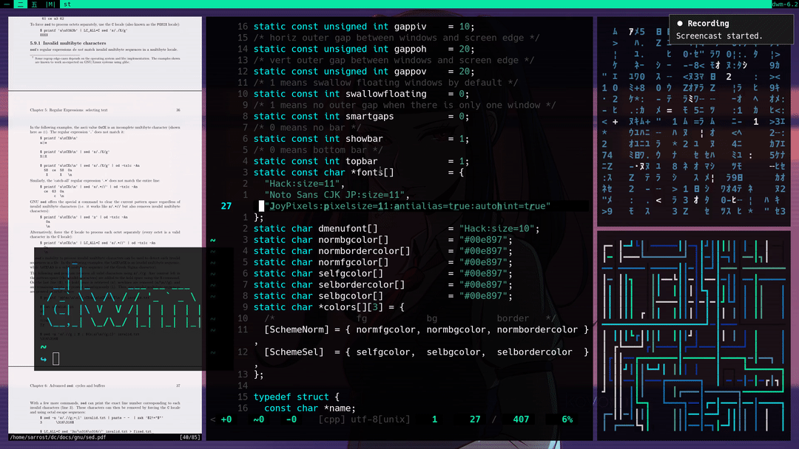

# My personal build of dwm

<p align="center">
  
</p>

## What is dwm?

[dwm](https://wiki.archlinux.org/index.php/Dwm) is a (tiling) dynamic window manager for Xorg. 

"In computing, a tiling [window manager](https://en.wikipedia.org/wiki/Tiling_window_manager) is a window manager with an organization of the screen into mutually non-overlapping frames, as opposed to the more popular approach of coordinate-based stacking of overlapping objects (windows) that tries to fully emulate the desktop metaphor."

dwm in particular is extremely light-weight and extensible, as adding functionality requires modifying the source code directly! I do not maintain any documentation save for the essentials necessary to get up and running. Once installed read the man page for basic key-binds.

```bash
man dwm
```

## Requirements

* Configured [Xorg](https://wiki.archlinux.org/index.php/Xorg)
* Basic dev utils: git, make, gcc (if you don't know if you have them or not then you have them)

## Installation 

```bash
git clone https://github.com/sarrost/dwm
cd dwm/src
sudo make install
```

dwm is only one small piece of my setup. For everything to work 100% straight outta the box please see my [dotfiles](https://github.com/sarrost/dotfiles), [scripts](https://github.com/sarrost/scripts), [dwmblocks](https://github.com/sarrost/dwmblocks), and [st](https://github.com/sarrost/st) repos. If you're willing to even try using dwm in any capacity this should not be too much of an inconvenience.

Additionally, It is not uncommon modify and maintain your own build of dwm, as opposed to installing it as a normal package. It is [suckless](https://suckless.org/philosophy/) afterall. There are plenty of tutorials online to help you understand how to properly patch (modify) dwm and other suckless software. This build itself was originally a fork of [Luke's](https://github.com/lukesmithxyz/dwm).

### Please install `libxft-bgra`!

This build of dwm does not block color emoji in the status/info bar, so you must install [libxft-bgra](https://aur.archlinux.org/packages/libxft-bgra/) from the AUR (if you're on Arch), which fixes a libxft color emoji rendering problem, otherwise dwm will crash upon trying to render one. Hopefully this fix will be in all libxft soon enough.

## Patches and features

- **notitile**: Removed window title in bar
- **alpha patch**: Transparent bar bitches (took a whole day to get working!)
- Reads xresources colors/variables (i.e. works with `pywal`, etc.)
- **scratchpad**: Accessible with mod+'
- **New layouts**: bstack, fibonacci, deck, centered master and more. All bound to keys `super+(shift+)t/y/u/i`
- True fullscreen (`super+f`) and prevents focus shifting
- Windows can be made sticky (`super+s`)
- **stacker**: Move windows up the stack manually (`super-K/J`)
- **shiftview**: Cycle through tags (`super+g/;`)
- **vanitygaps**: Gaps allowed across all layouts
- **swallow patch**: if a program run from a terminal would make it inoperable, it temporarily takes its place to save space

## Contact

* Herbert Magaya <herbert.magaya@protonmail.com>
